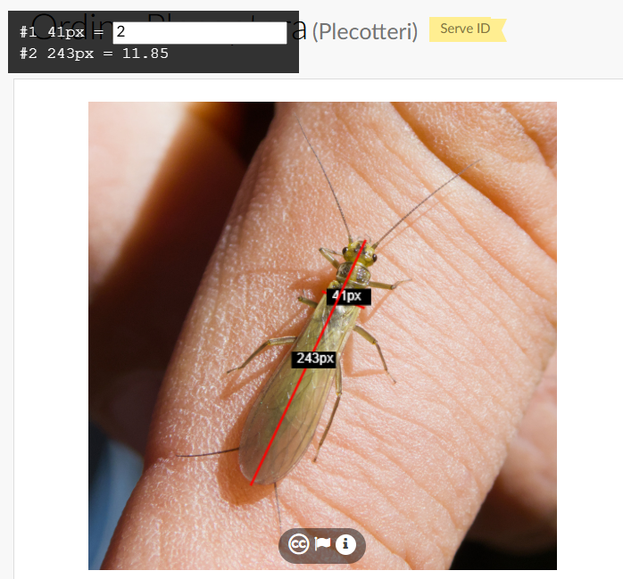

# screen-ruler
Extension for Chrome for taking measures on web pages.

THIS IS STILL UNDER TEST, bugs and bad things can happen.
You're advised to check the code before using it.

## Installation
* download this repo in a folder on your PC (Code -> Download ZIP)
* Open Chrome -> Extensions -> Manage extensions
* Enable "Developer mode"
* Click on "Load unpacked" and select the folder you just downloaded

## How to use it
Click on "Extensions" button, click on the Screen Ruler icon, and click Start Measuring:

* on the page, the cursor should change to crosshairs
* left click: start a line
* another left click: stop the line

**To stop measuring, click again the Screen Ruler icon and click Stop Measuring**.

